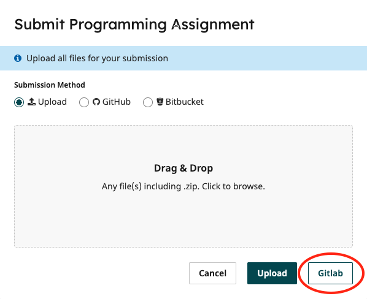

# Exercise: Probing a cache

In this exercise, you will construct some test data that will expose
the different behaviours of caching strategies. 

If you have completed the first coursework exercise (implementation of
caching), you may find that useful when testing your solutions. The
examples are small enough, however that they can be worked through
with pen and paper, so it is not necessary for you to have completed
the first coursework exercise.

In the first exercise, we considered different caching
strategies: Cyclic, LRU, MRU and LFU. The key difference is in the
*eviction* strategies -- deciding which element to replace when the
cache is full and we want to cache an new element. 

The strategies used here are as follows:

1. `Cache` Default, where no caching takes place.
1. `CyclicCache` Cyclic strategy.
   * Assume slots ```1,...,N``` in the cache.
   * Keep track of the next slot in the cache to be used (starting
     with ```1```).
   * When an value is cached, we increment our slot count to use the
   next slot.
   * Once all slots have been filled, go back to slot ```1``` and
     cycle round. 
2. `LRUCache` an LRU (least recently used) strategy.
   * Assume ```N``` slots.
   * Keep track of how recently each slot has been used (accessed or stored).
   * If the cache is full and a new value needs to be stored, we
     remove the entry from the slot that was least recently used and replace with
     the new value.
3. `MRUCache` an MRU (most recently used) strategy.	 
   * Assume ```N``` slots.
   * Keep track of how recently each slot has been used (accessed or stored).
   * If the cache is full and a new value needs to be stored, we
     remove the entry from the slot that was most recently used and replace with
     the new value.
4. `LFUCache` an LFU (least frequently used) strategy.
   * Assume ```N``` slots.
   * Keep track of how many times each item in the cache has been
     requested and the order in which they have been added to the cache.
   * If the cache is full and a new value needs to be stored. we
	 remove the entry that is least frequently used, i.e with the
	 smallest number of requests. If there is a "tie", then evict the
	 item that was the item that was added *first*, i.e. the item that has
     been in the cache for the longest time. 

When given a sequence of memory locations to access, we may see
different patterns of behaviour.

Let's look at an example. You may find it useful to draw some pictures
to help understand the status of the cache at each stage of the
process.

Take a situation where we have a cache of size 5, we start with an
empty cache, and we ask for the following locations in sequence:

```
0, 1, 2, 3, 4, 0, 5, 1, 0, 1
```

If we consider a `CyclicCache` strategy, for the first five requests (`0, 1,
2, 3, 4`), we will retrieve from memory and add the result to the
cache. When we make a request for location `0`, this is in the cache,
so we have a cache hit. Next we request location `5`. This is not in
the cache, so we retrieve from memory. We then wish to add this to the
cache. The cache is full (5 elements), so we must evict an
element. Address `0` will be chosen. Now we request `1`. This is in
the cache, so there is no memory request but a cache hit. Then we
request `0`. This was evicted from the cache, so must now be retrieved
again from memory. In order to add this to the cache, we must again
evict, so will choose `1` based on the `CyclicCache` strategy. Finally we
request `1` again, which results in us have to retrieve from memory
again. This results in a total of 8 memory accesses and 2 cache hits.

If we consider an `LRUCache` strategy, the results will be different. The
first five access requests (`0, 1, 2, 3, 4`) result in memory requests and items being
added to the cache. The next request for `0` is served from the
cache. When we then ask for `5`, we retrieve from memory. When we need
to now choose a candidate for eviction, we will select `1`, as this is
the least recently used location. On the next request for `1`, we then
need to go back to memory as we have just evicted `1`. On adding `1`
to the cache, `2` will then be selected for eviction. The last two
requests, for `0` and `1` can then be served from the cache. This
results in a total of 7 memory accesses and 3 cache hits.

Thus we can see that the sequence of accesses given above results in
fewer memory requests when using `LRUCache` than when using `CyclicCache`. There may
also be scenarios where `CyclicCache` would be a better choice (in terms of
reducing memory requests). It can be useful to understand the patterns
of access that result in such differences in performance. This
exercise is intended to explore that question. 

# The Task

The task here is to develop sets of test data that will demonstrate
the behaviours of different cache implementations. Read the
instructions carefully, particularly those relating to the ranges of
test data that you should be using.

There are several sub tasks. Each of which will be of the form:

*Provide a sequence of **n** locations. When the locations are
requested in sequence to implementations using **strategyA** and
**strategyB** and a cache size of **cacheSize**, the number of memory
requests recorded by **strategyB** plus **difference** must be
less than or equal to the number of memory requests recorded by
**strategyA**. The cache should be empty before the first request.*

Consider the following test data specification:

<table>
<thead>
<tr><th>Name</th><th>n</th><th>strategyA</th><th>strategyB</th><th>cacheSize</th><th>difference</th></tr>
</thead>
<tbody>
<tr><td>sample</td><td>6</td><td>Cache</td><td>CyclicCache</td><td>5</td><td>1</td></tr>
</tbody>
</table>

An example of a test sequence that *fails* to meet this specification
is the sequence:

```
0
1
2
3
4
5
```

This sequence is the correct length (6 items). When the locations are
requested in sequence, however, this will result in 6 memory
requests, regardless of the caching strategy (no location is
repeated).

An example of a test sequence that *meets* the specification is the
sequence:

```
0
1
2
3
4
0
```

Again, this sequence has 6 elements as required. If the sequence of
locations is requested from the `Cache` implementation (that applies
no caching strategy), this will result in 6 memory requests. If
`CyclicCache` is being used, after the first five requests, the cache
will contain values for locations `0` to `4`. The next request for
location `0` results in a cache hit, and a final total of 5 memory
requests.

We have 5+1 <= 6, so the test sequence *meets* the
specification.

There may be multiple sequences that meet the specification. For
example,

```
0
1
2
3
4
4
```

would also be acceptable here.

## Test Specifications

For each test specification `<spec>` below, you should provide a
sequence of locations in the file `data/<spec>.in`. Each location
should be on a separate line, and the set of locations should result
in the behaviour specified.

<table>
<thead>
<tr><th>Name</th><th>n</th><th>strategyA</th><th>strategyB</th><th>cacheSize</th><th>difference</th></tr>
</thead>
<tbody>
<tr><td>6_cache_cyclic</td><td>6</td><td>Cache</td><td>CyclicCache</td><td>5</td><td>1</td></tr>
<tr><td>10_cyclic_lfu</td><td>10</td><td>CyclicCache</td><td>LFUCache</td><td>5</td><td>1</td></tr>
<tr><td>10_cyclic_lru</td><td>10</td><td>CyclicCache</td><td>LRUCache</td><td>5</td><td>1</td></tr>
<tr><td>10_lfu_cyclic</td><td>10</td><td>LFUCache</td><td>CyclicCache</td><td>5</td><td>1</td></tr>
<tr><td>10_lfu_lru</td><td>10</td><td>LFUCache</td><td>LRUCache</td><td>5</td><td>1</td></tr>
<tr><td>10_lru_cyclic</td><td>10</td><td>LRUCache</td><td>CyclicCache</td><td>5</td><td>1</td></tr>
<tr><td>10_lru_lfu</td><td>10</td><td>LRUCache</td><td>LFUCache</td><td>5</td><td>1</td></tr>
<tr><td>10_mru_cyclic</td><td>10</td><td>MRUCache</td><td>CyclicCache</td><td>5</td><td>3</td></tr>
<tr><td>10_mru_lfu</td><td>10</td><td>MRUCache</td><td>LFUCache</td><td>5</td><td>3</td></tr>
<tr><td>10_mru_lru</td><td>10</td><td>MRUCache</td><td>LRUCache</td><td>5</td><td>3</td></tr>
<tr><td>10_cache_cyclic</td><td>10</td><td>Cache</td><td>CyclicCache</td><td>5</td><td>4</td></tr>
<tr><td>10_cache_lfu</td><td>10</td><td>Cache</td><td>LFUCache</td><td>5</td><td>4</td></tr>
<tr><td>10_cache_lru</td><td>10</td><td>Cache</td><td>LRUCache</td><td>5</td><td>4</td></tr>
<tr><td>10_cache_mru</td><td>10</td><td>Cache</td><td>MRUCache</td><td>5</td><td>4</td></tr>
<tr><td>20_cyclic_lfu</td><td>20</td><td>CyclicCache</td><td>LFUCache</td><td>5</td><td>2</td></tr>
<tr><td>20_cyclic_lru</td><td>20</td><td>CyclicCache</td><td>LRUCache</td><td>5</td><td>2</td></tr>
<tr><td>20_lfu_cyclic</td><td>20</td><td>LFUCache</td><td>CyclicCache</td><td>5</td><td>2</td></tr>
<tr><td>20_lru_cyclic</td><td>20</td><td>LRUCache</td><td>CyclicCache</td><td>5</td><td>2</td></tr>
</table>

## Test Data

There are a set of files in directory `data`. By default these contain
a single location (0). If you submit the repository as given, the
autograder will run, but all tests other than those that check for the
existence of files will fail.

Your task is to edit those files and provide appropriate test data. 

> [!IMPORTANT]  
> Read this section carefully. If you fail to follow the instructions here you will get **zero** for this component of the coursework.

Your test data **must** use a particular range of locations. This
range is determined by your **eight digit registration** number. If your
registration number is `i`, then you can use any of the 20 locations in the
range `i` to `i+19` inclusive. As an example, if your id number is `12345678`,
then allowable locations are in the (inclusive) range:

```
12345678 -- 12345697
```

If you use any locations outside of this range, the tests will
**fail**. 

Some (but not all) of the specifications have associated zero weighted tests that will check 
aspects of your submissions. These will check 

* the existence of the data file (`exists`)
* the number of locations in the data file (`count`)
* the validity of locations according to the scheme above
  (`locations`)
  
Note that passing the zero-weighted tests is **not** a guarantee that
your test data does the right thing. They are simply checking that
files are there, locations are in the expected range and that there
are the correct number of locations given.

The first test `6_cache_cyclic` is presented as an example
above. You should be able to use the information given there to
construct suitable test data which will allow you to check whether the
autograder is working with your submission. The results of this test
should be visible after submission.

# Submission

The code will be autograded using a system called
**GradeScope**. Gradescope will pull code from your gitlab repository
and then run a sequence of tests, generating a mark. 

On submission, Gradescope will run your test data against a reference
implementation and the results will be reported. 

On the submission page for the exercise, you will see an option to
submit via gitlab.



When you do this for the first time, you will be
asked to authorise the application. Once you have done this, you will
be able to select a repository and branch to submit. The code on that
branch will then be pulled by Gradescope and tests will be run.

Note that you will receive some feedback on the test, in particular
some checks on valid locations, but not the results of all the tests
used for grading. Thus your final mark will not be
visible until after the submission date. You can continue to develop
your test data and resubmit as many times as you wish before the
deadline: tests will be rerun on re-submission.

